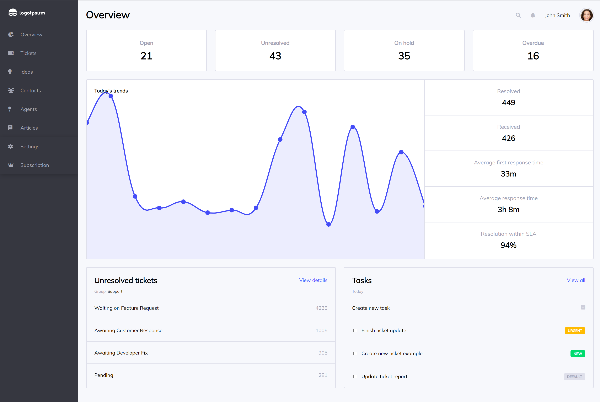

# Admin Dashboard 

Admin Dashboard for The Odin Project using mainly CSS grid

## Demo

[Live Demo](https://kmatic.github.io/admin-dashboard/)

## Built with

- CSS
- HTML

## Resources used

- [Figma Design](https://figma.com/community/file/809559910249051285) (Design files)
- [Logoipsum](https://logoipsum.com) (Placeholder Logo)
- [MagicPattern](https://magicpattern.design/tools/svg-chart-generator) (SVG Chart)
- [MinimalToolkit](https://minimaltoolkit.com/random-user-profile-image.html) (Placeholder User Name/Image)
- [FontAwesome](https://fontawesome.com/icons) (Icons)

Inspiration from https://github.com/Mmackz/admin-dashboard

## TO-DO

- Fully responsive design
- Code clean-up